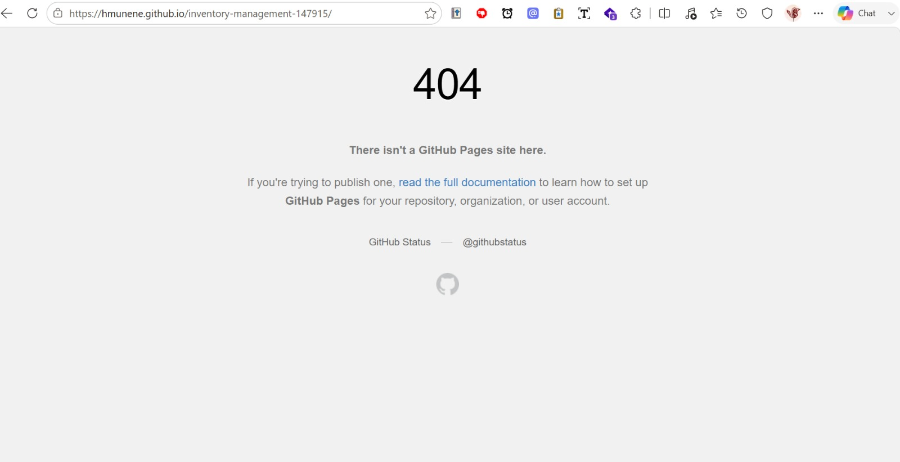
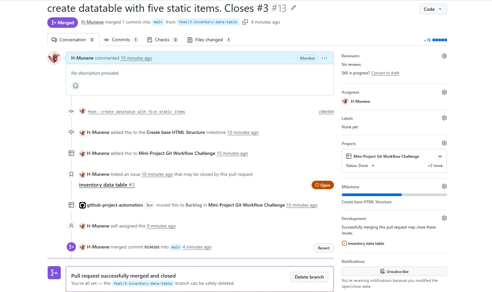
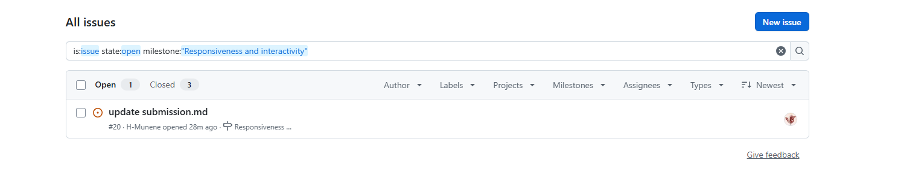
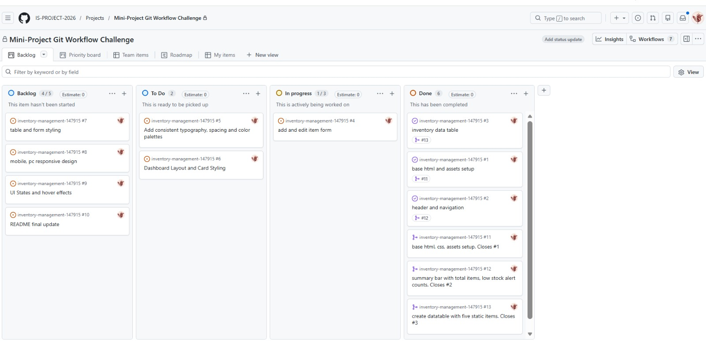
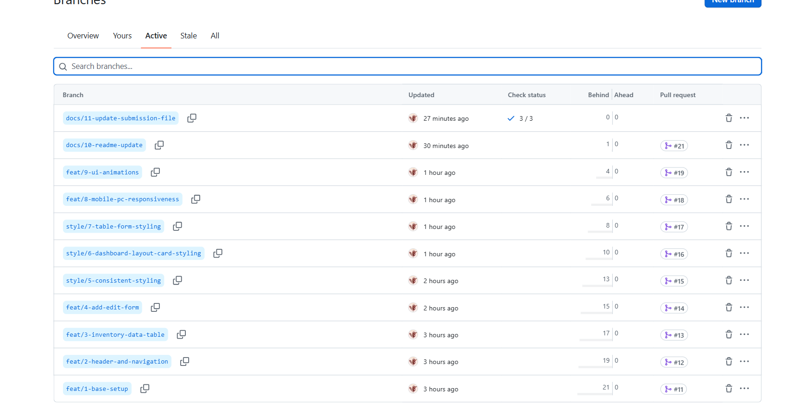
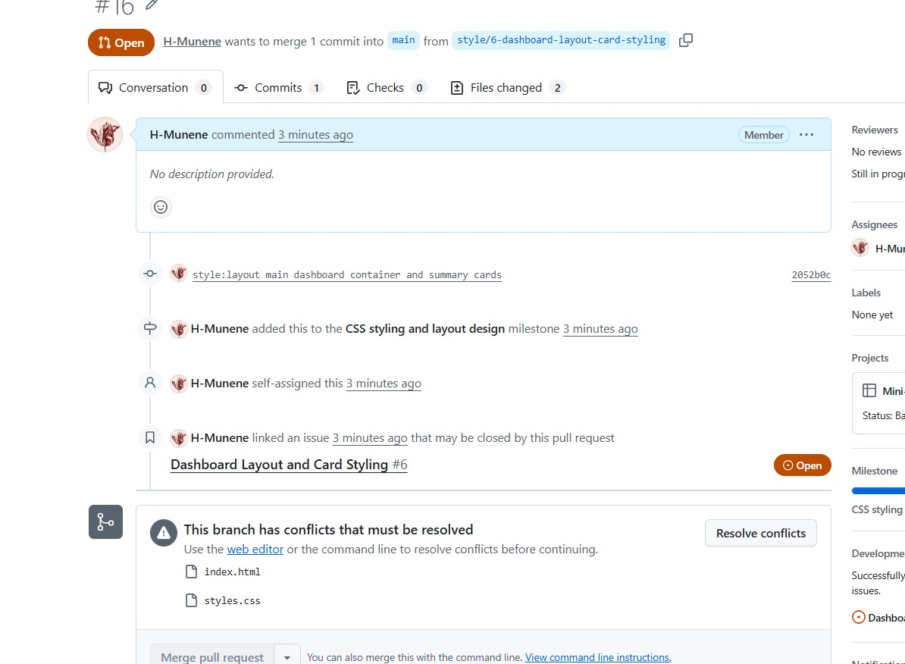
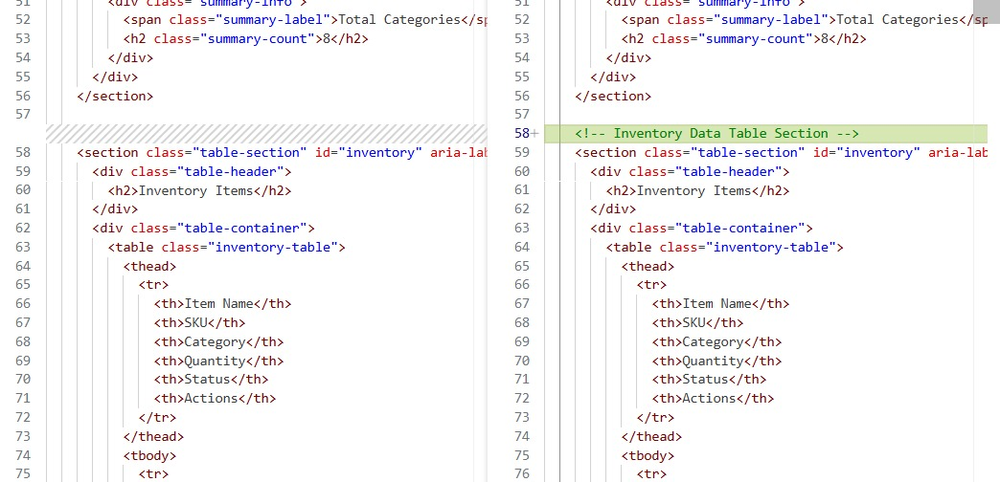
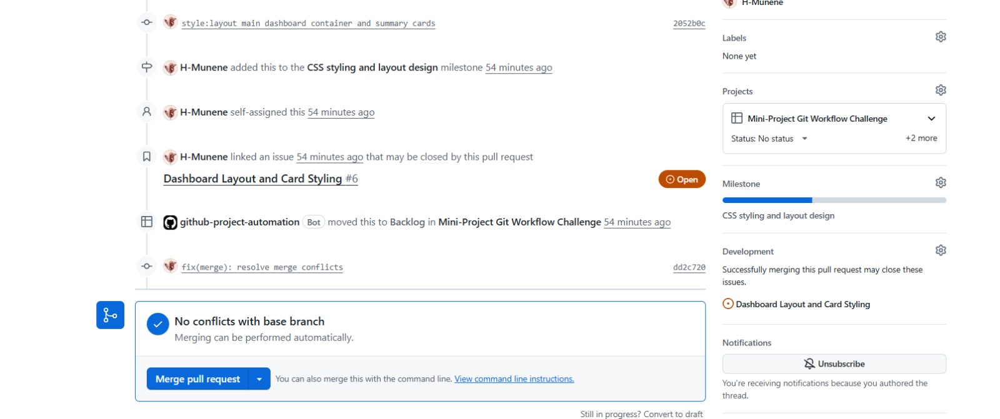
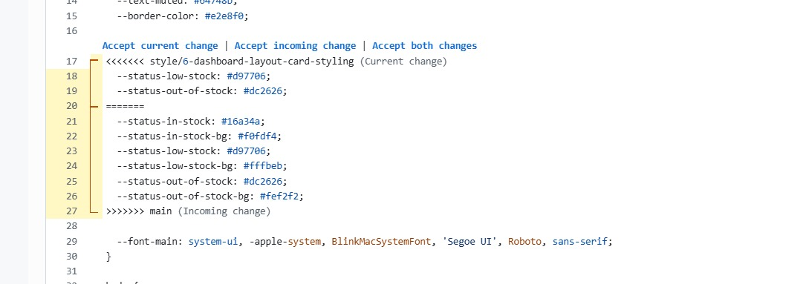
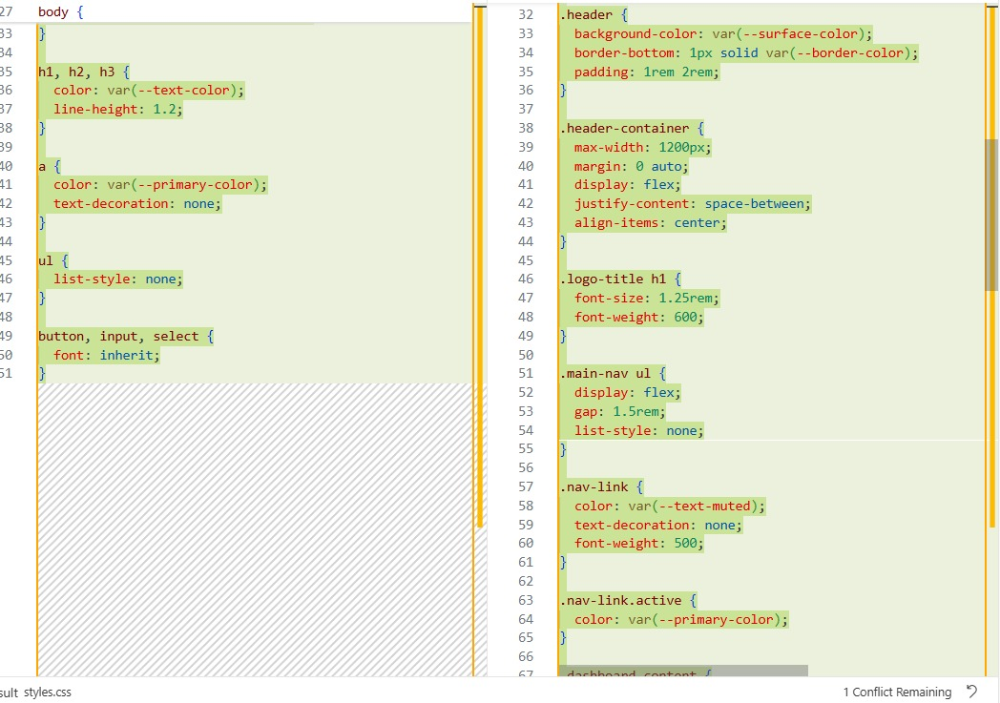

# Project Submission Report

## 1. Student Details

- **Full Name:** Munene Hezekiah Muiruri
- **GitHub Username:** H-Munene
- **Email:** hezemunene01@gmail.com, hezekiah.munene@strathmore.edu 

---

## 2. Deployed Project Link

- **Live GitHub Pages URL:** [https://is-project-2026.github.io/inventory-management-147915/]

---

## 3. Reflection — Grounded in Your Git History

> **Rules:** Every answer below **must include a direct link** to the specific commit, PR, issue, or branch in your repository that demonstrates what you are describing. Answers without working links will not be graded. Generic explanations that could apply to any project will receive zero marks.
>
> **Marks:** A (2 marks) · B (1 mark) · C (1 mark) · D (1 mark) = **5 marks total**

### A. Your Best Commit

Paste the URL of the commit in your history that you think best demonstrates clean conventional commit practice (good type tag, clear subject, meaningful body or footer).

- **Commit URL:** [https://github.com/IS-PROJECT-2026/inventory-management-147915/commit/4f083ca4af28df53493bddc0422f65a2eef2988a]
- **Why this one?** [This commit successfully makes the site responsive to different screen sizes. It also follows the conventional commits format and has a clear and concise description of the changes made.]

### B. A Mistake or Struggle

Link to a commit, PR, or issue where something went wrong — a bad commit message you had to fix, a branch you had to delete and recreate, a PR that needed rework, or a deployment that broke. 

- **Link to the evidence:** 
- **What happened and how did you recover?** This was an issue I faced when trying to deploy the website to GitHub Pages. I had included the wrong folder i.e /docs instead of /root, which caused the deployment to fail. I also used the wrong deployment linke i.e. https://hmunene.github.io/inventory-management-147915 instead of https://is-project-2026.github.io/inventory-management-147915/

### C. A Pull Request You're Proud Of

Paste the URL of the PR that best shows your self-review process — one where the description is clear, the issue linkage is correct, and the diff tells a coherent story.

- **PR URL:** [https://github.com/IS-PROJECT-2026/inventory-management-147915/commit/c88e56423e4246a5f1045d0499b7eb6973596436]
- **What did you check before merging?** I ensured it contained the **Closes** keyword to automatically close the linked issue
- **Link to the evidence:** 

### D. One Thing You Would Do Differently

If you had to restart this project from scratch with everything you know now, name one specific workflow decision you would change (not a code change — a Git/project management decision).

- **What would you change?** I would include the name of the file i changed in the commit message
- **Link to the evidence of the original decision:** [https://github.com/IS-PROJECT-2026/inventory-management-147915/commit/c17aa16646456beccb6ecb636d25cbff3d168a67]

---

## 4. Screenshots of Key GitHub Features

Demonstrate your workflow mechanics by embedding your screenshots below.

> **CRITICAL FOR WORKING IMAGES:** Do not type manual folder paths. Edit this file directly on the GitHub web interface, click on the blank line below each prompt, and **paste (Ctrl+V / Cmd+V)** your screenshot. GitHub will automatically upload the file and generate a permanent, working image link for you.

### A. Milestones and Issues
*Provide a screenshot showing your active milestone(s) and the granular tracking issues linked directly to them.*

* **Caption:** [This is the Responsiveness and interactivity milestone with 3 issues closes and one pending issue remaining to be closed]

### B. Project Board
*Provide a screenshot of your GitHub Project Board with your issues organized dynamically across columns (To Do, In Progress, Done).*

* **Caption:** [This is the Kanban board showing the issues in different stages of completion namely: backlog, to do, in progress and done]

### C. Branching Architecture
*Provide a screenshot showing your local or remote Git branch list, highlighting your use of conventional, issue-linked naming patterns (e.g., `feat/`, `fix/`, `style/`).*

* **Caption:** This is the branch list showing all the branches in my repository

### D. Pull Requests & Traceability
*Provide a screenshot of a completed or open Pull Request (PR) on GitHub that clearly shows it is linked to a related development issue.*

* **Caption:** This is a closed pull request that was linked to issue number 3 which was to create an inventory data table

---

## 5. Merge Conflict Evidence

You must engineer **three merge conflicts**, each triggered by a **different cause** from those covered in the lecture. For Conflict 1, document the full resolution lifecycle. For Conflicts 2 and 3, provide the conflict marker screenshot and identify the cause.

> **Marks:** Conflict 1 full chronology (2 marks) · Conflict 2 (1 mark) · Conflict 3 (1 mark) · All three use distinct causes (1 mark) = **5 marks total**

---

### Conflict 1 — Full Chronology

**What cause did you use?** [S]

#### Step 1: Generating the Clash
*Screenshot showing the merge attempt and the conflict warning.*

* **Caption:** This is the merge conflict warning I received when trying to merge the branches

#### Step 2: Inside the Code Editor (Conflict Markers)
*Screenshot showing the raw, unresolved conflict markers (`<<<<<<< HEAD`, `=======`, `>>>>>>>`) in your editor.*

* **Caption:** [Explain what caused the dispute and your reasoning for the final version]

#### Step 3: Resolution & Clean Merge
*Screenshot of your clean Git history or completed PR showing the conflict was resolved and merged.*

* **Caption:** This is the PR showing the merge conflict was resolved

---

### Conflict 2 — Different Cause

**What cause did you use?** Modified Content

**Why does this cause trigger a conflict?** This conflict occurs when two different branches have the same file but with different content

* **Caption:** This is a merge conflict caused by modifying an existing file
---

### Conflict 3 — Different Cause

**What cause did you use?** Different name for same file

**Why does this cause trigger a conflict?** This conflict occurs when two different branches have the same file but with different names

* **Caption:** This is a merge conflict caused by appending content to the end of the file

---
##
## 6. Feedback & Evaluation

To help improve this course for future engineering cohorts, please take 2 minutes to fill out the anonymous feedback form. Your honest review helps shape how this program is taught next semester!
- [ ] **Anonymous Evaluation Form:** [Course & Instructor Evaluation](https://forms.gle/YLybnsyXXErKEg3s9)
